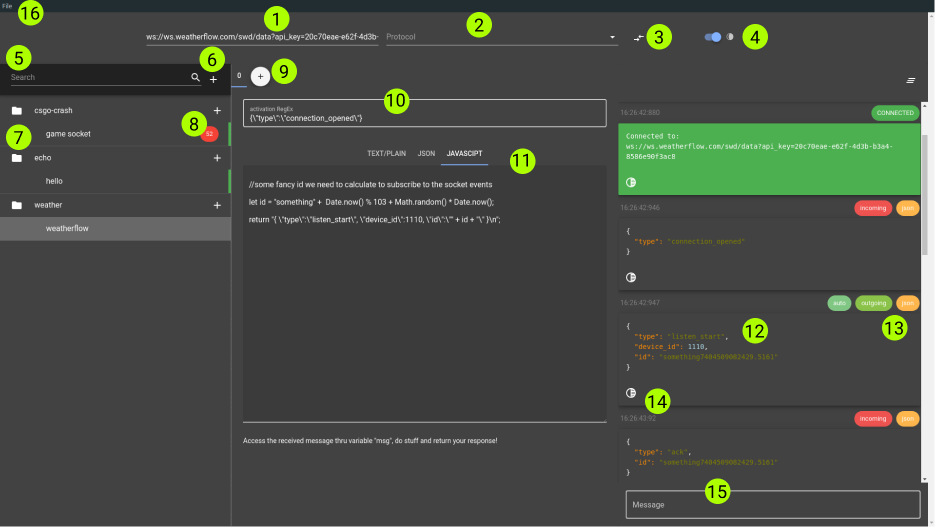

## Welcome dev!

We recently were using Postman for a project and noticed that it was lacking a websockets integration.

How can that be in the year 2021‽ Websockets are much needed in todays world, where data has to flow in real time.
### Our vision

That is why we took it on ourselves to develop a tool that can be used to test and automate websocket APIs, much like Postman is used for HTTP.
Our goal was to create an app that is lightweight, crossplatform and rather good looking. But most importantly it had to extensible.

### The tool

As you take a look at SocketDude's GUI you might just figure out everything there is to know about it on your own.
If that's not the case or you are interested in details continue reading down below.



```markdown
GUI Components

1. URL to connect to
2. protocol to use
3. re/connect
4. switch dark/light-theme
5. search projects or sockets
6. create project
7. project-list
8. missed/new messages
9. add response-handler
10. regular expression
11. returned response
12. formatted json message
13. message tags
14. toggle raw/formatted
15. send message box
16. load/save state
```

The Gui can be split into five sections:
- open/Save project
- connection settings
- project manager
- response handlers
- chat

## How to

*Loading/saving/creating/deleting projects*
You can create a new Project by clicking on <b>6</b>.
Each project has a default name, which can be changed by right clicking on the project tile. 
Deleting a project can be achieved by using the right-click-menu.
If you have already created projects in the past or want to save your current projects
you can use <b>16</b> to do load or save them.

*adding/removing sockets*
Each projet can have multiple websockets, which their also can have a name.
Once you added a websocket to your project (+) you can then select it and change its
connection properties (<b>1,2</b>).
Once you are satisfied you may hit <b>3</b> to connect to the server.

*the chat*
Upon connecting to a server you will see a message appear in that chat, that you were connected successfully (or not).

All sent messages and events will appear here.
Each chat-message can carry multiple tags (incoming, outgoing, json, text, etc.).
You can manually send a message by typing into <b>15</b> and hitting enter.

*adding/removing handlers*
This is where automation comes to play!
SocketDude has multiple ways for you to send automated messages back to the server upon receiving a message that matches the handlers RegEx.

To add a handler you click on <b>9</b>.
Each handler has an activation RegExPattern (<b>10</b>) and three response tabs (<b>11</b>).
Once the RegEx matches the incoming message it returns the content of its currently
selected tab. 
The only exception is if you select "Javascript". The Javascript-tab consumes the incoming message. The message's content can be accessed by using the predefined 
variable "msg". The code that you type in the Javascript-tab gets run and the return value is then sent back as a response to the server.
You can use multiple handlers with the same regex, which will evaluated in order of their creation.

You can rename and delete message handlers using the right-click menu.
